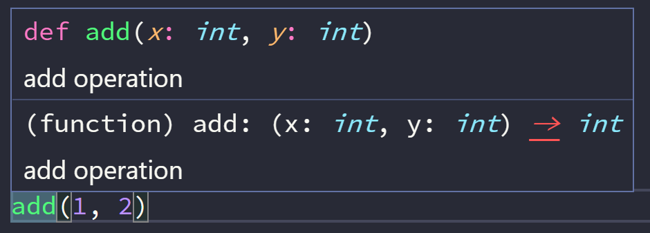
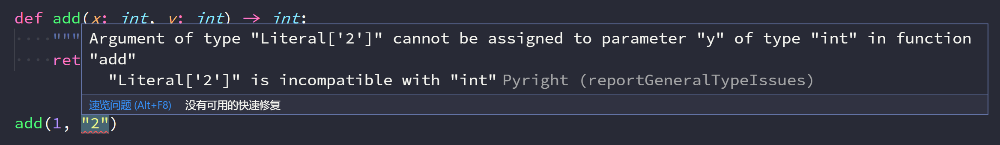
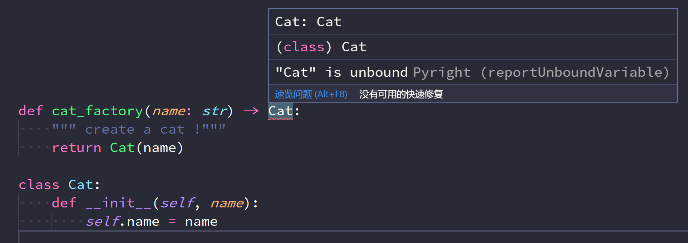
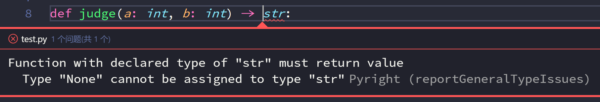
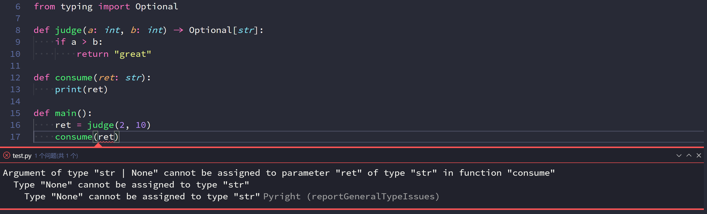
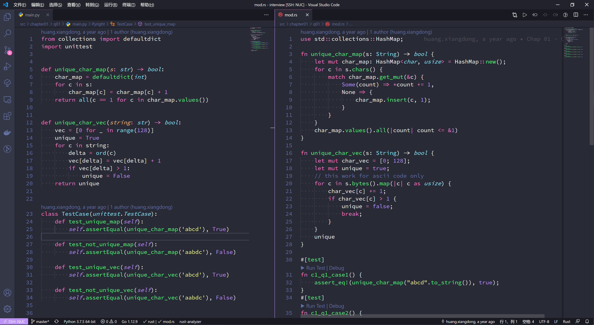

这一阵在公司内部写一个小项目，逻辑不复杂，但数据类型正确非常重要。最开始因为内网中的 vscode 版本太低，只开了最基本的 Python 插件。
后来因为 vscode 版本升级，我便启用了 pyright 插件，打开后 vscode 满眼红色波浪线，仔细查看报错原因，很多报错都是我没有处理返回值 `None` 导致的，最后我修复了至少4个隐藏 bug。
经过几次使用，我觉得类型提示是 Python 3 仅次于 Union code, async await 异步函数的优秀功能，是一个值得认真学习的新特性。配合 vscode + pyright 插件，可以写出可读性和维护性更高的代码。
可惜类型提示在社区中发展缓慢，讨论度似乎没有那么高。

在 Python 3 第一个正式版本发布前，2006年 [PEP 3107](https://www.python.org/dev/peps/pep-3107/) 函数注解的提案被发起并于 Python 3 中实现。
这个协议允许在函数签名中直接添加参数和返回值注释，而不是把它们写在函数的 doc string 里。如

```python
def compile(source: "something compilable",
            filename: "where the compilable thing comes from",
            mode: "is this a single statement or a suite?"):
    pass
```

很自然的，基于这个功能我们可以尝试用注解说明期望的参数和返回值类型，如

```python
def haul(item: Haulable, *vargs: PackAnimal) -> Distance:
    pass
```

但直到2014年 [PEP 484](https://www.python.org/dev/peps/pep-0484/) 提案才正式确定了 `type hints` 即类型提示的语法，并在 Python 3.5 版本正式发布。
也是在同一年， typescript 正式发布，与目前大红大紫的 typescript 不同，类型提示在 Python 社区好像没有掀起风浪，机器学习和AI风头正盛，没多少人注意到这个从构想到实现花了8年的新特性。

## 基本使用

需要 Python 3.5+, 每个大版本 typing 都会发布新特性，因此建议 Python 版本越新越好。
接着是 vscode, 安装官方的 Python 插件和 [pyright](https://marketplace.visualstudio.com/items?itemName=ms-pyright.pyright), pyright 增强了 vscode 对 Python 类型提示的支持。

函数注解支持使用基本类型

```python
def add(x: int, y: int) -> int:
    """ add operation """
    return x + y
```

将鼠标悬停在函数名上会显示参数类型和函数说明



如果你传入不同类型的参数，pyright 会提示你参数类型不匹配



用户自己定义的类也可以作为类型提示

```python
class Cat:
    def __init__(self, name):
        self.name = name


def cat_factory(name: str) -> Cat:
    """ create a cat !"""
    return Cat(name)
```

某些情况下一些类型还没定义或在函数定义时导入该类型会导致循环导入，此时可以用字符串代替类型。
比如我把 Cat 定义放到 cat_factory 后面，此时 pyright 会提示 Cat unbound



将函数定义改为

```python
def cat_factory(name: str) -> 'Cat':
    """ create a cat !"""
    return Cat(name)
```

即可修复 pyright 报错。

当然，你也可以在某一行末尾使用 `# type: ignore` 注释提示 pyright 忽略此行类型检查。

虽然上面三个功能已经让我们向写出正确的 Python 代码迈出了第一步。但这还不够，pyright 能提供更强类型提示功能。

## 进阶使用

### Optional

你定义了如下函数，pyright 会报错，为什么？

```python
def judge(a: int, b: int) -> str:
    if a > b:
        return "great"
```



因为函数中的 if 导致了函数返回值有可能为 `None`，这与函数的类型提示不符，因此我们可以添加 else 分支返回字符串，修复这个报错。
但有时候函数就是有可能返回 None 或者某个值，了解 Rust 应该知道这时候可以用 `Option<T>` 来表示返回值类型。
Python 的类型提示也提供了类似的 [Optional](https://docs.python.org/3/library/typing.html#typing.Optional) 类型。

`Optional[T]` 相当于 `T or None`, 如果用联合类型表示即为 `Union[T, None]`。

因此上面的函数也可以修改为

```python
from typing import Optional

def judge(a: int, b: int) -> Optional[str]:
    if a > b:
        return "great"
```

当其他函数使用 judge 时，Optional 会提示你不要忘了处理返回值为 None 的情况。



这个功能在写复杂函数时非常有用，可以有效减少忘记判断某些分支或提前返回导致返回值出现了预期之外类型的错误。

### Union

上面我们提到了 Union 类型，顾名思义它表示多个类型的集合，Optional 也只是它的一个特例。
有时候函数需要多种类型，这时就需要用到 Union。

```python
from typing import Union

def ret_multi(a: int, b: int) -> Union[str, int]:
    if (a >= b):
        return a - b
    else:
        return 'No!'
```

### 更精确的复合类型

对于 dict, list, tuple 等可以包含其他类型的复合类型，简单的 dict, list 类型提示还不能明确说明它们包含的元素类型，
因此 typing 提供了 `Dict`, `Tuple`，`List` 等类型。

```python
from typing import List, Dict, Tuple, Union


# 声明一个 int 列表
int_list: List[int] = [100, 100]

# 声明一个键为 str, 值为 int 的字典
mapping: Dict[str, int] = {"1": 1}

# 声明一个含有两个 int 元素的元组
corr_x_y: Tuple[int, int] = (1, 2)
# 注意 pyright 会检查元组长度，如下面的复制会导致 pyright 报错
corr_too_many: Tuple[int, int] = (1, 2, 3)
# 如果要表示可变长度，可以用 `...`
corr_var: Tuple[int, ...] = (1, 2, 3)

# 如果有多种可能的元素类型，可以使用 `Union`
union_list: List[Union[int, str]] = [100, 'Good']
```

### 函数类型提示

Python 经常用到高阶函数，因此，如何在参数和返回值类型提示表达函数是经常会遇到的问题，
为此 typing 提供了 `Callable`

```python
from typing import Callable,


def add(a: int, b: int) -> int:
    return a + b

def apply(fn: Callable[[int, int], int], *args: int) -> int:
    return fn(args[0], args[1])
```

`Callable` 定义为 `[[参数类型, ...]， 返回值类型]`

### 类型别名

有时候，某些类型会变得非常复杂，或者使用别名会提高代码可读性时，类型别名是非常有用的技巧，
以下是文档中的例子。通过类型别名定义了 `UserId`，而且 `ProUserId` 也能从 `UserId` 中
派生而来。

```python
from typing import NewType

UserId = NewType('UserId', int)

ProUserId = NewType('ProUserId', UserId)
```


## 彩蛋

Python 的类型提示借鉴了不少其他语言特性，熟悉某些这些语言的人，看到这些类型提示，可能会心一笑，这不是 xx 吗。

---

比如 `final`，Java 和 C++ 中的关键字，这里以装饰器存在， 提示此方法不可重载, 用户类时提示此类不可继承。

```python
from typing import final

class Base:
    @final
    def done(self) -> None:
        ...
class Sub(Base):
    def done(self) -> None:  # Error reported by type checker
          ...

@final
class Leaf:
    ...
class Other(Leaf):  # Error reported by type checker
```

还有 `Any`, <del>TypeScript</del> AnyScript 表示这我熟悉。
如果你不知道返回值或者类型是什么，用 `Any` 吧，当然，后果自负。

---

`NoReturn` 类似 Rust 中的 `!` 返回值类型，提示这个函数永远不会返回

```python
from typing import NoReturn

def stop() -> NoReturn:
    raise RuntimeError('no way')
```

---

`Literal` 即字面量，它表示类型有效值应该和字面量一样。我觉得它最有用的地方在于表示有些枚举值时非常简单。
比如文件操作时 `r`, `rb`, `w` flag，定义一个 Enum 非常繁琐，但用下面的例子则非常简单方便

```python
from typing import Literal

MODE = Literal['r', 'rb', 'w', 'wb']
def open_helper(file: str, mode: MODE) -> str:
    ...

open_helper('/some/path', 'r')  # 正确
open_helper('/other/path', 'typo')  # pyright 报错
```

---

最后我觉得加了类型提示的 Python 乍一看很 Rust 相似度挺高的😀。



