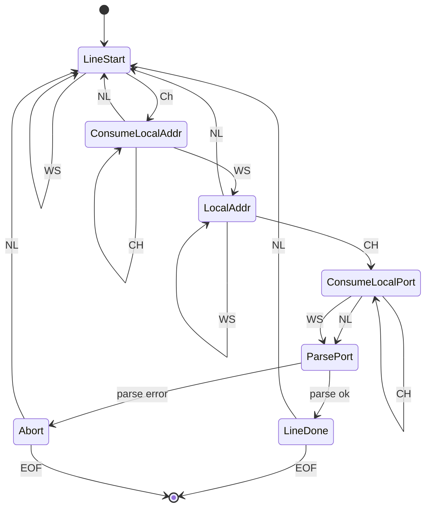

# 更快的 tsv 解析


- [更快的 tsv 解析](#更快的-tsv-解析)
  - [项目搭建](#项目搭建)
  - [regex 解析](#regex-解析)
  - [减少内存分配](#减少内存分配)
  - [使用 ascii 正则](#使用-ascii-正则)
  - [抛弃 regex](#抛弃-regex)
  - [手写解析状态机](#手写解析状态机)
  - [SIMD 加速?](#simd-加速)
  - [总结](#总结)


最近在B站冲浪时发现一个 Rust 和 Go 解析 tsv 文件的视频, 作者需要解析使用 `get-NetTCPConnection | Format-Table -Property LocalAddress,LocalPort,RemoteAddress,RemotePort,State,OwningProcess` 获取的本地所有 TCP 连接信息, 文件输出大致如下

```tsv
LocalAddress                          LocalPort RemoteAddress                     RemotePort       State OwningProcess
------------                          --------- -------------                     ----------       ----- -------------
192.168.1.4                               54339 104.210.1.98                             443 Established          4504
```

视频作者使用 regex 正则库处理输出, 发现比 Go 版本慢, 优化后虽然比 Go 快, 但并没有领先多少, 于是我自己尝试使用别的优化方法, 解析耗时能优化使用正则解析的 10% 左右. 下面来看看我的优化过程.

## 项目搭建

进行性能时建议使用 [criterion](https://github.com/bheisler/criterion.rs), 它帮我们解决了性能的内存预加载, 操作耗时, 性能记录, 图表输出等功能.

```bash
cargo new --lib tsv
cd tsv
cargo add criterion --dev -F html_reports
cargo add regex
```

然后在 Cargo.toml 里添加如 bench 文件

```toml
[[bench]]
name = "parse"
harness = false
```

```rs
// benches/parse.rs
#![allow(dead_code)]
use criterion::{black_box, criterion_group, criterion_main, Criterion};

const OUTPUT: &str = include_str!("net.tsv");

fn criterion_benchmark(c: &mut Criterion) {
    todo!()
}

criterion_group!(benches, criterion_benchmark);
criterion_main!(benches);
```

测试使用的 tsv 一共 380 行.

## regex 解析

使用正则解析的正则表达式很简单, 这里直接给代码, 为了避免重复编译正则表达式和重新分配内存报错结果列表, 这里将她们作为参数传给解析函数.

```rust
struct OwnedRecord {
    local_addr: String,
    local_port: u16,
    remote_addr: String,
    remote_port: u16,
    state: String,
    pid: u64,
}
fn regex_owned(input: &str, re: &regex::Regex, result: &mut Vec<OwnedRecord>) {
    input.lines().for_each(|line| {
        if let Some(item) = re.captures(line).and_then(|captures| {
            let (_, [local_addr, local_port, remote_addr, remote_port, state, pid]) =
                captures.extract();
            let ret = OwnedRecord {
                local_addr: local_addr.to_string(),
                local_port: local_port.parse().ok()?,
                remote_addr: remote_addr.to_string(),
                remote_port: remote_port.parse().ok()?,
                state: state.to_string(),
                pid: pid.parse().ok()?,
            };
            Some(ret)
        }) {
            result.push(item);
        }
    });
    assert_eq!(result.len(), 377);
}
```

parse.rs 文件里要加上使用的正则和提前创建好列表, 并且将函数添加的 bench 目标里

```rust
fn criterion_benchmark(c: &mut Criterion) {
    let re = regex::Regex::new(r"(\S+)\s+(\d+)\s+(\S+)\s+(\d+)\s+(\S+)\s+(\d+)").unwrap();
    let mut r1 = Vec::with_capacity(400);
    c.bench_function("regex_owned", |b| {
        b.iter(|| {
            // 重置输出 vector
            r1.clear();
            regex_owned(black_box(OUTPUT), &re, &mut r1);
        })
    });
}
```

接着跑 `cargo bench --bench parse` 进行测试, 在我的电脑上测得每次运行耗时 450 µs 左右.

## 减少内存分配

一个最简单的优化是使用 `&str` 以减少每次创建 `String` 带来的内存分配和数据复制.

```rust
struct Record<'a> {
    local_addr: &'a str,
    local_port: u16,
    remote_addr: &'a str,
    remote_port: u16,
    state: &'a str,
    pid: u64,
}
```

两个函数代码差不多, 所以这里不再列出来, 可以通过 [gits: tsv 解析](https://gist.github.com/PrivateRookie/3cc2330f9bbeb1115efb4a49f0627298) 获取完整代码.

可惜这次改动带来的优化非常小, 在我的电脑上反复测量, 这个版本耗时在 440 µs 左右.

## 使用 ascii 正则

rust 的 regex 正则默认使用 unicode, 相比于 ascii 编码, unicode 更复杂, 因此性能也相对较低, 刚好要解析的内容都是ascii字符, 使用 ascii 正则是否能提升解析速度呢? regex 有 `regex::bytes` 模块用于 ascii 解析, 但为了适配字段, 这里不得不使用 `transmute` 将 `&[u8]` 强制转换成 `&str`

```rust
fn cast(data: &[u8]) -> &str {
    unsafe { std::mem::transmute(data) }
}
fn regex_ascii<'a>(input: &'a str, re: &regex::bytes::Regex, result: &mut Vec<Record<'a>>) {
    input.lines().for_each(|line| {
        if let Some(item) = re.captures(line.as_bytes()).and_then(|captures| {
            let (_, [local_addr, local_port, remote_addr, remote_port, state, pid]) =
                captures.extract();
            let ret = Record {
                local_addr: cast(local_addr),
                local_port: cast(local_port).parse().ok()?,
                remote_addr: cast(remote_addr),
                remote_port: cast(remote_port).parse().ok()?,
                state: cast(state),
                pid: cast(pid).parse().ok()?,
            };
            Some(ret)
        }) {
            result.push(item);
        }
    });
    assert_eq!(result.len(), 377);
}
```

添加到 bench 后性能大概多少呢?, 很遗憾, 性能与 regex_borrow 差不多, 在 430 µs 左右.

## 抛弃 regex

鉴于内容格式比较简单, 如果只使用 rust 内置的 split 等方法解析性能会不会更好呢?
解析思路很简单, 使用 `lines` 得到一个逐行迭代器, 然后对每行使用 split 切分空格再逐个解析即可

```rust
fn split<'a>(input: &'a str, result: &mut Vec<Record<'a>>) {
    input
        .lines()
        .filter_map(|line| {
            let mut iter = line.split([' ', '\t', '\r']).filter(|c| !c.is_empty());
            let local_addr = iter.next()?;
            let local_port: u16 = iter.next()?.parse().ok()?;
            let remote_addr = iter.next()?;
            let remote_port: u16 = iter.next()?.parse().ok()?;
            let state = iter.next()?;
            let pid: u64 = iter.next()?.parse().ok()?;
            Some(Record {
                local_addr,
                local_port,
                remote_addr,
                remote_port,
                state,
                pid,
            })
        })
        .for_each(|item| result.push(item));
    assert_eq!(result.len(), 377);
}
```

注意 `line.split` 只后还需要过滤不是空白的字符串, 这是因为字符串 `"a   b"` split 之后得到 `["a", "", "b"]`.

经测试, 这个版本测试耗时大概为 53 µs, 这真是一个**巨大提升**, rust 的 regex 性能确实有些问题.

每次 split 之后还需要 filter 感觉有些拖沓, 刚好有个[split_whitespace](https://doc.rust-lang.org/std/primitive.str.html#method.split_whitespace), 换用这个方法, 将新的解析方法命名为`split_whitespace`后再测试下性能

```rust
let mut iter = line.split_whitespace();
```

令人意想不到的是性能居然倒退了, 这次耗时大概 60 µs, 仔细研究下来还是 unicode 的问题, 改用 ascii 版本的 `split_ascii_whitespace` 之后性能提升到 45 µs.

## 手写解析状态机

除了上述的方法, 我还尝试将 Record 的 local_addr 和 remote_addr 改成 `std::net::IpAddr`, 消除 `next()?.parse().ok()?` 等其他方法, 但收益几乎没有, 唯一有作用的办法是手写解析状态机.

大致思路是, 对于输出来说, 我们只关系它是以下三种情况

1. 换行符 NL
2. 除了换行符的空白符 WS
3. 非空白字符 CH

只解析 LocalAddr 和 LocalPort 解析状态机如下, 如果要解析更多字段, 按顺序添加即可.



因为代码有些复杂, 所以这里不再贴出来, 完整代码在 gits 上. 手写状态机的版本耗时大概在 32 µs 左右. 这版本主要性能提升来自手写状态机减少了循环内的分支判断.

## SIMD 加速?

在上面手写解析的例子里, 处理过程类似与将输出作为一个 vec, 状态机作为另一个 vec, 将两个 vec 进行某种运算后输出结果, 应该能使用 simd 进行加速, 但我还没想出高效实现. 所以这里只给出可能的参考资料

1. [zsv](https://github.com/liquidaty/zsv) 使用 simd 加速的 csv 解析库
2. [simd base64](https://mcyoung.xyz/2023/11/27/simd-base64/) 一篇介绍使用 simd 加速 base64 解析的博客, 非常推荐

## 总结

rust regex 在某时候确实存在性能问题, 有时候使用简单的 split 的方法手动解析反而更简单性能也更高, 如果情况允许, 使用 ascii 版本能进一步提升性能, 如果你追求更好的性能, 手写一个状态不失为一种选择, 当然我不建议在生产上这么做. 同时我也期待有 simd 加速的例子.

