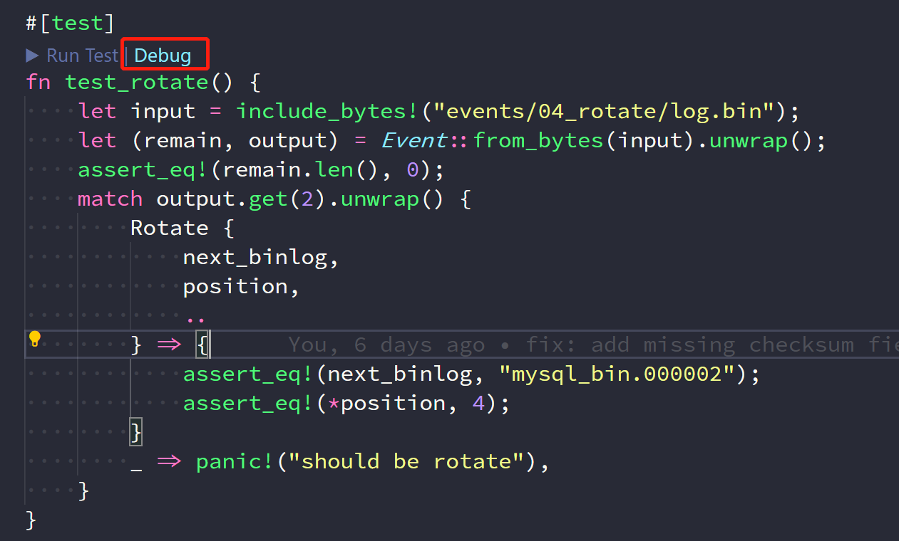

# boxercrab 0.2.0 发布


boxercrab 来自使用 Nom 写解析器的一个练习项目，写着写着觉得项目挺好玩，就想着把项目功能都实现，没想到踏入了一个大坑。经过近2个月零零散散的开发，boxercrab 终于达到了勉强能用的水平，所以 boxercrab 0.2.0 正式发布🎉。

---

## 项目介绍

[boxercrab](https://github.com/PrivateRookie/boxercrab) 是一个基于 Rust nom 库实现的 MySQL binlog 文件解析库，纯 Rust 实现，无需 mysql-server 库。

boxercrab 即拳击蟹，这种螃蟹会在自己的钳子上附着海蜇，通过挥舞带魔法攻击的钳子搜寻猎物，形似项目在 binlog 找到自己需要内容的工作模式，而且 boxercrab 和 Rust 的吉祥物 Ferris 都是螃蟹，寓意 boxercrab 是基于 Rust 实现的。

boxercrab 项目的目标是尽量解析 binlog 事件的每个字段。比对于 `write_rows_v2` 事件， boxercrab 可以给出这个事件的 flags 和写入的每列数据。

假设有如下 sql

```sql
DROP TABLE IF EXISTS `boxercrab`;

CREATE TABLE `boxercrab` (
    `id` INT UNSIGNED AUTO_INCREMENT,
    `title` VARCHAR(40) NOT NULL,
    PRIMARY KEY (`id`)
)ENGINE=InnoDB DEFAULT CHARSET=utf8mb4;

INSERT INTO `boxercrab` (`title`) VALUES ('abcde');
```

使用如下命令解析 binglog 文件

```bash
bcrab trans <binlog> output.yaml -f yaml
```

boxercrab 解析的 `write_rows_v2` 带着事件 header 头，table_id, 甚至插入的每列数据(rows, 数据大部分为 u8)

```yaml
WriteRowsV2:
  header:
    timestamp: 1596179173
    event_type: 30
    server_id: 1
    event_size: 46
    log_pos: 980
    flags:
      in_use: false
      forced_rotate: false
      thread_specific: false
      suppress_use: false
      update_table_map_version: false
      artificial: false
      relay_log: false
      ignorable: false
      no_filter: false
      mts_isolate: false
  table_id: 111
  flags:
    end_of_stmt: true
    foreign_key_checks: true
    unique_key_checks: true
    has_columns: true
  extra_data_len: 2
  extra_data: []
  column_count: 2
  inserted_image_bits:
    - 255
  rows:
    - - Long:
          - 1
          - 0
          - 0
          - 0
      - VarChar:
          - 97
          - 98
          - 99
          - 100
          - 101
  checksum: 81937473
```

当然由于项目草创，文档过时，不熟悉C++等原因，还不能做到解析所有事件，已经解析的事件
有些还没有经过充分的测试，目前解析进度为

| Hex  | Event Name               | Parsed | Note               |
| ---- | ------------------------ | ------ | ------------------ |
| 0x01 | START_EVENT_V3           | N      | too old to support |
| 0x02 | QUERY_EVENT              | Y      |                    |
| 0x03 | STOP_EVENT               | Y      |                    |
| 0x04 | ROTATE_EVENT             | Y      |                    |
| 0x05 | INTVAR_EVENT             | Y      |                    |
| 0x06 | LOAD_EVENT               | Y      | not tested         |
| 0x07 | SLAVE_EVENT              | Y      | not tested         |
| 0x08 | CREATE_FILE_EVENT        | Y      | not tested         |
| 0x09 | APPEND_BLOCK_EVENT       | Y      | not tested         |
| 0x0a | EXEC_LOAD_EVENT          | Y      |                    |
| 0x0b | DELETE_FILE_EVENT        | Y      | not tested         |
| 0x0c | NEW_LOAD_EVENT           | Y      | not tested         |
| 0x0d | RAND_EVENT               | Y      |                    |
| 0x0e | USER_VAR_EVENT           | Y      | not fully tested   |
| 0x0f | FORMAT_DESCRIPTION_EVENT | Y      |                    |
| 0x10 | XID_EVENT                | Y      |                    |
| 0x11 | BEGIN_LOAD_QUERY_EVENT   | Y      |                    |
| 0x12 | EXECUTE_LOAD_QUERY_EVENT | Y      |                    |
| 0x13 | TABLE_MAP_EVENT          | Y      | not fully tested   |
| 0x14 | WRITE_ROWS_EVENTv0       | N      |                    |
| 0x15 | UPDATE_ROWS_EVENTv0      | N      |                    |
| 0x16 | DELETE_ROWS_EVENTv0      | N      |                    |
| 0x17 | WRITE_ROWS_EVENTv1       | N      |                    |
| 0x18 | UPDATE_ROWS_EVENTv1      | N      |                    |
| 0x19 | DELETE_ROWS_EVENTv1      | N      |                    |
| 0x1a | INCIDENT_EVENT           | Y      | not tested         |
| 0x1b | HEARTBEAT_EVENT          | Y      | not tested         |
| 0x1c | IGNORABLE_EVENT          | N      |                    |
| 0x1d | ROWS_QUERY_EVENT         | Y      |                    |
| 0x1e | WRITE_ROWS_EVENTv2       | Y      | not fully tested   |
| 0x1f | UPDATE_ROWS_EVENTv2      | Y      | not fully tested   |
| 0x20 | DELETE_ROWS_EVENTv2      | Y      | not fully tested   |
| 0x21 | GTID_EVENT               | Y      |                    |
| 0x22 | ANONYMOUS_GTID_EVENT     | Y      |                    |
| 0x23 | PREVIOUS_GTIDS_EVENT     | Y      |                    |

测试数据库版本为 mysql 5.7.30

使用方式可以参考项目 [README](https://privaterookie.github.io/boxercrab/)

## 项目感受

首先我不得不吐槽 mysql 的 binlog 文档，有不少部分与实际内容不符，导致我不得不花大量事件查看 mysqlbinlog hexdump 出来的文件尝试将一个个 u8 与字段对应起来，
或者不得不翻看 mysql-server 源码。甚至还有在文档中注明不会出现在 binlog 中的 NewDate, NewDatetime 等数据类型偏偏出现在 binlog 文件中，文档不详，代码看不懂。
我甚至一度怀疑这些代码编译出来的 mysql 和 mysqlbinlog 到底能不能工作，Oracle 是不是发的假代码。

但好在有不少其他语言实现的类似项目，能提供借鉴，同时 mysql slack 频道的 Swany 老哥也非常活跃，知道我不熟悉 C++ 还帮我翻阅了源码找到对应的实现。

回到项目本身，我觉得使用 Rust 的 nom 解析二进制文件比解析文本文件要简单，因为模式不会太复杂，nom 提供 `le_u8`, `map` 和 `tag` 工具基本都解决。如果你熟悉某个协议，实现 parser 花费不了多少时间。以我用 nom 写 json, redis 协议 parser 和 binlog parser 的经验看， **nom 是一个非常优秀的库，值得一试！**

整个项目都是在 vscode + rust-analyzer 环境中写出来的，经过大半年每周一版的稳定更新，rust-analyzer 已经把 rls 远远甩在身后。
rust-analyzer 提供 IDE了 一般的使用感受。我经常使用 F2 重命名功能，把不满意的变量、参数、或者结构体重命名，rust-analyzer 通过语义分析，可以保证一次修改，不出错，不遗漏。
对于辅助补全，rust-analyzer 对标准库和第三方库的支持都非常好，速度也很快，不久前的更新让 rust-analyzer 在 `Cargo.toml` 依赖变更时自动重载，新加入的依赖不需要重新打开项目即可拥有辅助补全。
最后是不多不说的 `#[test]` 测试函数上显示 Debug 命令，你可以通过鼠标直接点击进入 Debug 而不用配置复杂的 `launch.json` 文件，这项功能在有很多测试用例，又需要 debug 时非常有用。

效果如下



忘了 rls 吧，rust-analyzer 是最好的选择。


## 项目期望

boxercrab 详细解析每个事件的最初目标已实现了大半，剩下的是较少碰到的事件，或者是只在老旧版本出现的事件，从这个角度看 boxercrab 已经成功了。

同时因时间精力有限，没能进行详细的测试，这部分会慢慢补上来，如果各位能提供测试 binlog 文件和对应 SQL 补全测试用例，那是再好不过了。

boxercrab 目前最大的问题之一是它会一次性读取所有内容，如果 binlog 文件非常大，这会消耗很多内存，理想情况应该是流式解析，这也为 boxercrab 直接连接 mysql-server 持续监听 binlog，对数据源进行过滤，处理，监控提供了可能。这可能是 boxercrab 最实用的功能了。

如果你对 boxercrab 有什么意见或建议，欢迎在 github 上提 issue, 点个赞当然是非常欢迎的，🦀🦀！

项目主页: [PrivateRookie - boxercrab](https://github.com/PrivateRookie/boxercrab)